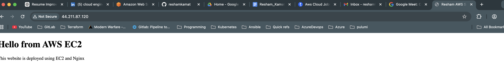

# AWS EC2 Web Server Deployment

This project demonstrates how to deploy a web server on Amazon EC2 and host a simple website.

## Architecture

User → Internet → AWS EC2 Instance → Nginx Web Server → Web Page

## Services Used

- Amazon EC2
- Amazon VPC
- Security Groups
- Linux
- Nginx Web Server

## Project Steps

1. Created an EC2 instance in AWS.
2. Selected Ubuntu / Amazon Linux AMI.
3. Configured security group rules:
   - SSH (Port 22) for remote access
   - HTTP (Port 80) for web traffic
4. Connected to the instance using SSH.
5. Installed Nginx web server.
6. Created a simple HTML page.
7. Accessed the website using the EC2 public IP.

## Commands Used

Update packages
sudo apt update

Install Nginx

sudo apt install nginx -y

Start Nginx

sudo systemctl start nginx

nstall Nginx
sudo apt update
sudo apt install nginx -y
4 Deploy Website

Navigate to the web directory

cd /var/www/html

Create website file

sudo nano index.html

Access Website

Open browser and visit

http://PUBLIC_IP

## Result

A web server was successfully deployed on AWS EC2 and is accessible through the instance public IP address.

http://44.211.87.120

screenshot :

       Internet
           |
           |
       Public IP
           |
    +---------------+
    |   AWS EC2     |
    |   Ubuntu      |
    |   Nginx       |
    +---------------+
           |
           |
       HTML website

Learning Outcomes

Through this project I learned:

How to launch and configure AWS EC2 instances

SSH access to Linux servers

Installing and configuring Nginx

Deploying a static website on cloud infrastructure

Basic cloud networking and security group configuration
